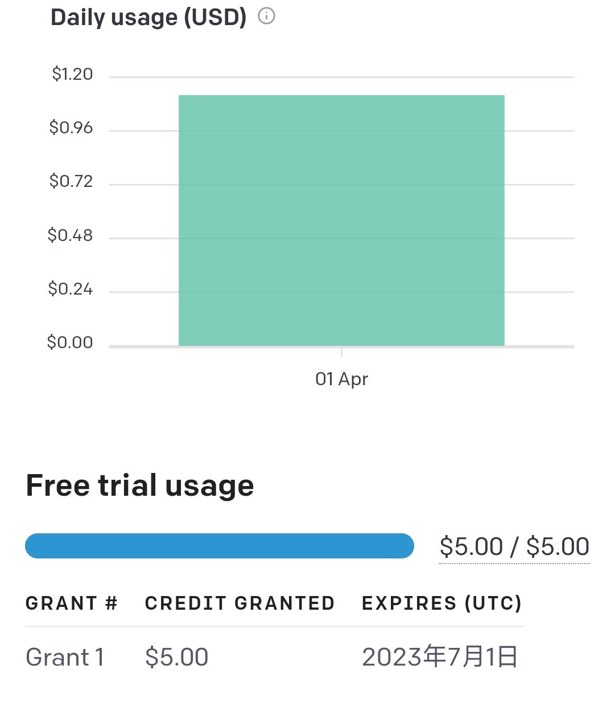
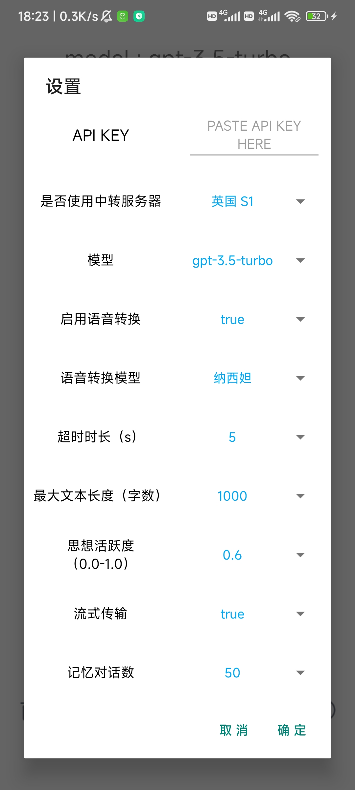
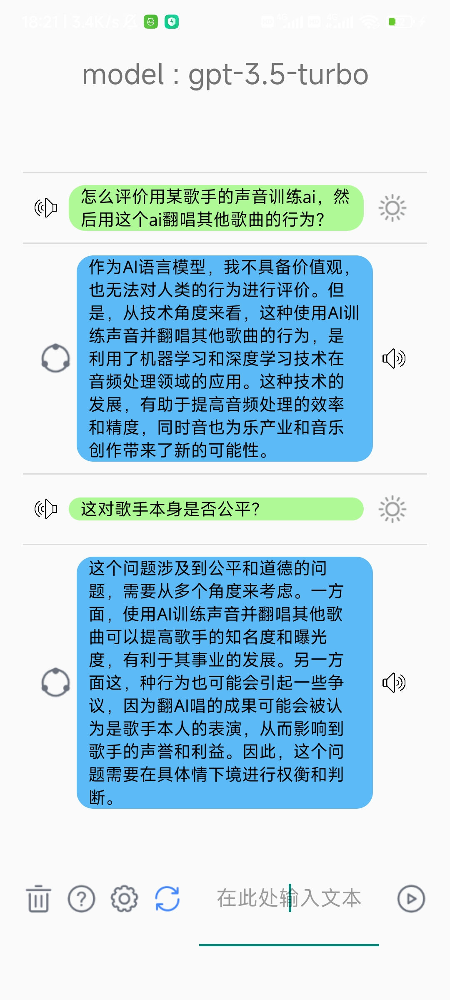

# ChatGPT_Android
an android demo to use openai's api

调用openai提供的接口，实现与ChatGPT对话

功能：

<del> ✓可以免费使用，无需登录（在本人账号余额耗尽之前，默认配置即可）</del>

× 本人账号余额已于2023.04.01耗尽，不再提供API KEY

✓ 支持至Gpt-3.5模型（因为本人买不起plus）

✓ 无需代理即可与ChatGPT对话（可以使用自己的服务器中转）

✓ 支持带记忆的连续对话，可以随时清除记忆

✓ 可以复制ai回答文本

✓ 使用流式传输，ai的回答是动态连续的

✓ 使用wss保护数据传输安全

？ vits语音合成（试行）。仅在 “英国 S1” 中转服务器 上运行。使用服务器CPU进行推理，计算速度极为缓慢，不建议使用。

# 关于收到乱码
如果你希望使用预置的中转服务器，请确保APP为github上的最新版本，见 https://github.com/icecoins/ChatGPT_Android/releases

乱码可能原因：由于 APP内置的通讯标记 与 服务器内置的通讯标记 不匹配，导致APP无法正常接收对话数据

如果你希望可以使用自定义的通讯标记，请更改APP与springboot的源码并自行编译、运行

# 关于直连官方接口失败：
因为某些原因， https://api.openai.com 已经被GFW dns阻断了

最新版本可以选择使用服务器运行springboot + websocket与APP即时通讯，进行数据中转，以此绕开sni

配套springboot项目地址：https://github.com/icecoins/ChatGPT_Server

你可以自行修改springboot中的代码以配适你的App

当然，你可以选中“不使用中转”， 并在手机上设置好代理，APP会直接向openai发送请求

# 关于语音转换：
引用自 https://github.com/SayaSS/vits-finetuning

# 关于api_key失效
api_key一旦被官方检测到一个key被多人使用就会自动失效

一个openai账号可以维持最多五个api key，也就是说可以让五个人分别专用一个账号下不同的key

# usage
check the configs first, confirm your api_key is available.

connected to the Internet.

首先检查配置，确保api_key可用

建议将文本长度调整至1000及以上

确保APP可以联网
